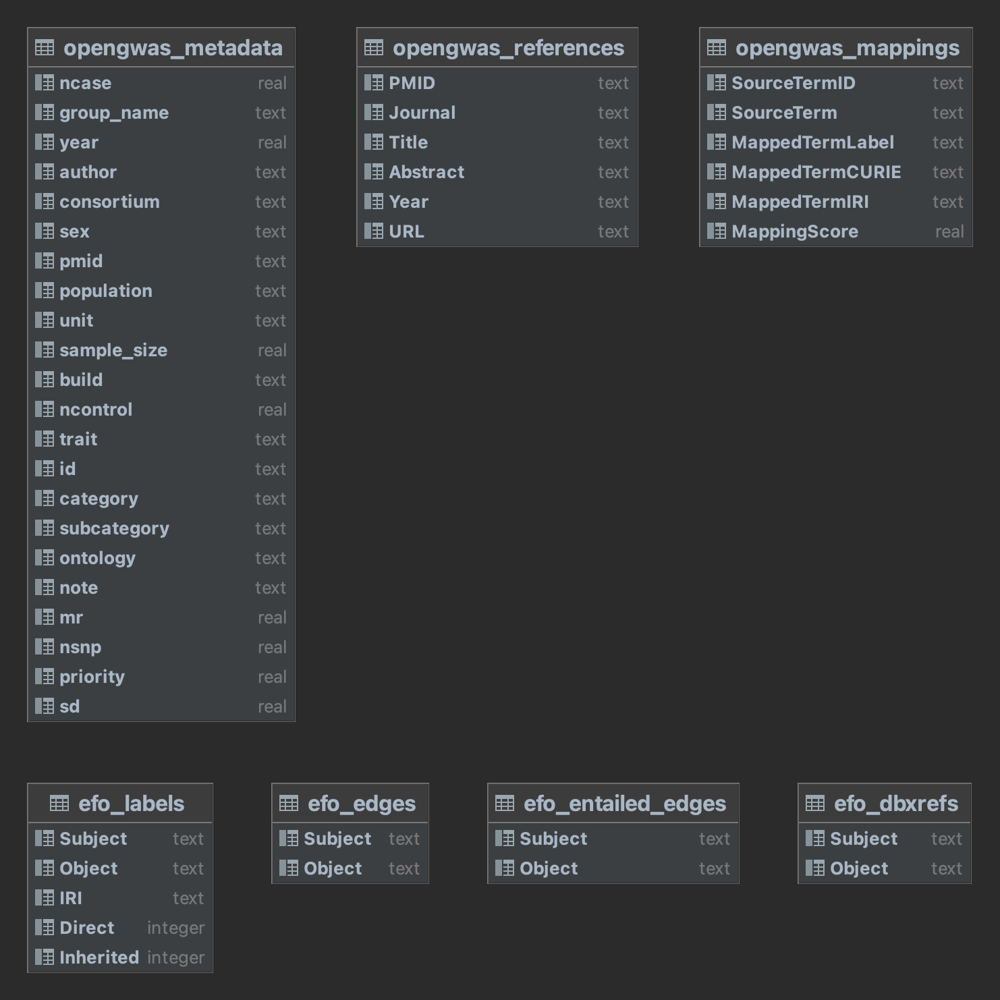
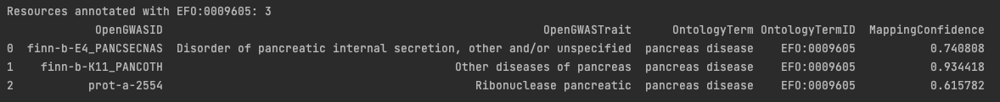
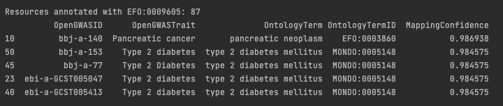

# Ontology-based OpenGWAS Search
This project aims to facilitate search for GWAS records in the OpenGWAS database. This is achieved by first computing ontology mappings of the traits specified in the OpenGWAS metadata, and then combining the mappings with tabular representations of ontology relationships such that users can search over traits by leveraging the ontology class hierarchy. 

`src/build_database.py` generates the SQLite3 database `opengwas_trait_search.db` that contains:
- The original OpenGWAS metadata table with all traits and associated OpenGWAS DB record identifiers
- [text2term](https://github.com/ccb-hms/ontology-mapper)-generated mappings of OpenGWAS traits to Experimental Factor Ontology (EFO) terms
- Tables that specify EFO terms—their labels, identifiers and mapping counts—and the asserted and inferred hierarchical (SubclassOf) relationships between EFO terms (extracted from a [SemanticSQL](https://github.com/INCATools/semantic-sql) EFO build). 

## Database Tables

- `opengwas_metadata` contains the original GWAS Catalog metadata table.
- `opengwas_references` contains details obtained from PubMed about the articles in the `PUBMEDID` column of the `gwascatalog_metadata` table.
- `opengwas_mappings` contains the text2term-generated mappings of the phenotypes in `trait` column of the metadata table to EFO.
- `efo_labels` contains the terms in EFO (`Subject` column), their labels (`Object` column), IRIs, and the counts of how many rows/records in the metadata are directly mapped to those terms (`Direct` column), or indirectly mapped to those terms via a more specific term in the hierarchy (`Inherited` column).
- `efo_edges` and `efo_entailed_edges` contain, respectively, the asserted and entailed hierarchical (IS-A/SubClassOf) relationships between terms in EFO.
- `efo_dbxrefs` contains database cross-references between terms in EFO and terms in other ontologies or controlled vocabularies, such as MeddRA, OMIM, MeSH, etc. 

## Example Queries
`src/example_query.py` contains a simple function to query the generated database for OpenGWAS records related to a user-given trait. Executing this script will perform example queries for three traits and print the results. 

For example, when searching for OpenGWAS records about `pancreas disease`, our approach returns the results:



A similar, keyword-based search in OpenGWAS would not have found these.  

Furthermore, users can search for records mapped to any more specific type of 'pancreas disease'— under the hood this is done by including subclasses of the ontology term for 'pancreas disease' in the search, obtaining the results:




## Acquiring and Preprocessing OpenGWAS Metadata
The metadata are obtained directly from OpenGWAS using the [ieugwaspy](https://github.com/MRCIEU/ieugwaspy) package—a Python interface to the OpenGWAS database API. The metadata preprocessing consists of removing all EQTL records—by discarding records whose `id` contains `eqtl-a`, which is the prefix for all such records. 


## Mapping Phenotypes in OpenGWAS Metadata to EFO
The inputs to _text2term_ are the metadata table and the EFO ontology, and the tool is configured to: 
- include only mappings with a score above a threshold (`min_score=0.6` in a [0,1] scale where 1=exact match).
- compute only the highest scored mapping for each trait in the metadata (`max_mappings=1`). 
- use the TFIDF mapper (`mapper=Mapper.TFIDF`), which computes TFIDF-based vector representations of traits and then uses cosine distance to determine how close each trait is to each ontology term. 
- exclude terms that have been marked as deprecated (`excl_deprecated=True`) such that we only map to terms that are current and expected to be in EFO's future releases.

EFO specifies relationships between terms that exist in external ontologies such as MONDO, ChEBI, etc. Since our goal is to map phenotypes to appropriate ontology terms, when they exist, we also configured _text2term_ to:

- only map to terms from ontologies that describe phenotypes: EFO itself, the Monarch Disease Ontology (MONDO), the Human Phenotype Ontology (HPO), the Orphanet Rare Disease Ontology (ORDO), and the Human Disease Ontology (DOID). This is done using the parameter `base_iris` which limits search to terms in the given namespace(s). 

_text2term_ configuration:
```python
min_score=0.6,          # minimum acceptable mapping score 
max_mappings=1,         # maximum number of mappings per input phenotype
mapper=Mapper.TFIDF,    # use the (default) TF-IDF-based mapper to compare strings  
excl_deprecated=True,   # exclude deprecated ontology terms
base_iris=("http://www.ebi.ac.uk/efo/", 
           "http://purl.obolibrary.org/obo/MONDO",
           "http://purl.obolibrary.org/obo/HP", 
           "http://www.orpha.net/ORDO",
           "http://purl.obolibrary.org/obo/DOID")
```


## Dependencies
The latest ontology-based search database was built using:
- OpenGWAS metadata snapshot from 05/09/2023
- Experimental Factor Ontology (EFO) v3.43.0
- tex2term v2.3.0